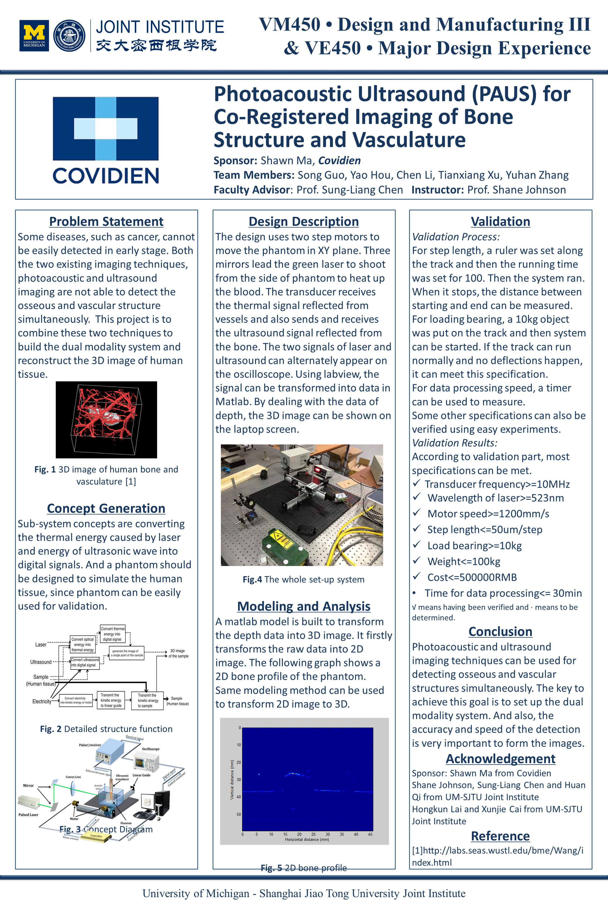

# UMJI Poster Template

This LaTeX template can be used to generate a poster in UM-SJTU-JI, for VG101, VE/VM450 and some other courses.

## Usage

The file `beamerthemeumjiposter.sty` should be used as a beamer theme to use this template. The example tex file can be found as `main.tex`.

## Font

On Linux, Calibri font is not provided by default. Run the following to install it.

```bash
wget -qO- http://plasmasturm.org/code/vistafonts-installer/vistafonts-installer | bash
rm PowerPointViewer.exe
```

## Demo

The diff of the official template in PowerPoint (left) and this LaTeX template (right) is shown below:

PowerPoint Template             |  LaTeX Template
:-------------------------:|:-------------------------:
 |  


